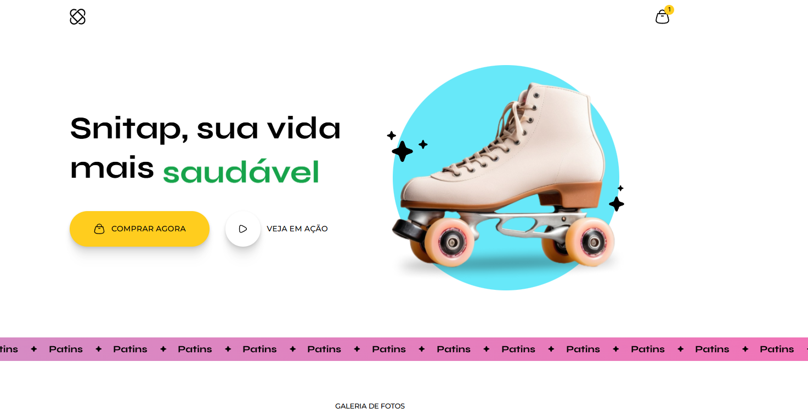
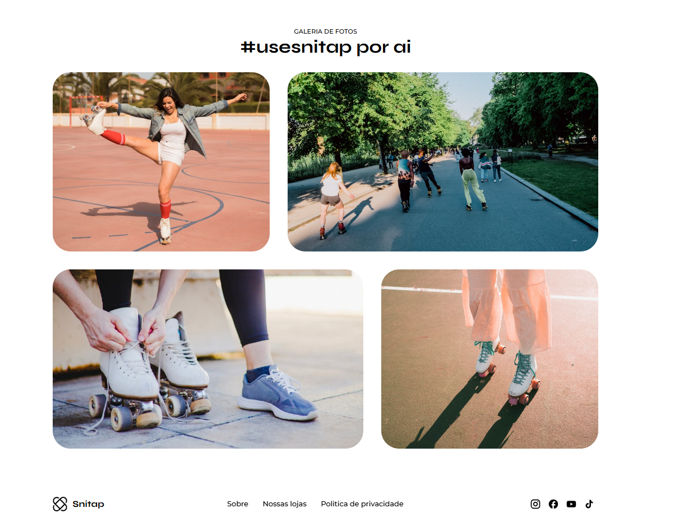
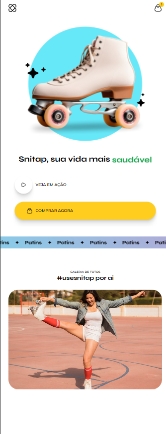
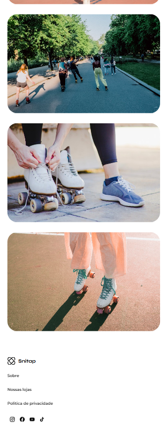

<h1 align="center" style="font-weight: bold;">SNITAP - PATINS💻</h1>

 <a href="#tech">Technologies</a> • 
 <a href="#started">Getting Started</a> • 

    <b>
      Fully animated paddings store landing page with letters transitioning and changing from radical to healthy to radical, with images coming in from left to right and adjusting opacity and the image gallery appearing as it scrorelates the screen using the animation-timeline: view() property.
    </b>
     
    <b>
      Made to train animations and attract customers.
    </b>

     <a href="">📱 Visit this Project</a>

<h2 id="layout">🎨 Layout Web</h2>

      
      

<h2 id="layout">🎨 Layout Mobile</h2>

      
      

<h2 id="tech">💻 Technologies</h2>

- HTML5
- CSS3

<h2 id="started">🚀 Getting started</h2>

- Just download the project with its assets and run it with liveserve or just by opening the html document

